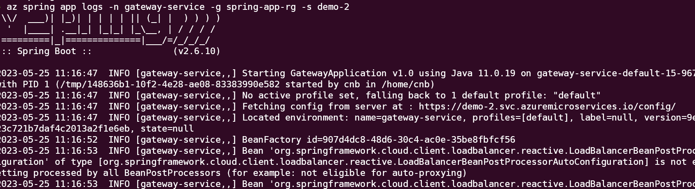
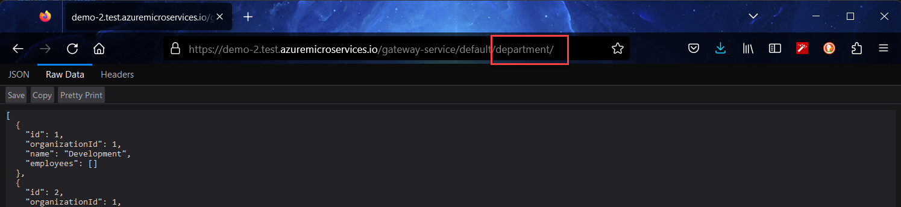
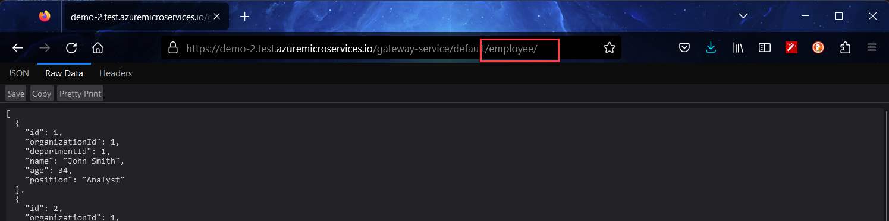

## Azure Resource Creation

### Pre-Requisites
- Azure Subscription [Get Free](https://azure.microsoft.com/en-us/free/)
- Azure CLI 2.x [Install](https://docs.microsoft.com/en-us/cli/azure/install-azure-cli?view=azure-cli-latest)


1.  Create the resource group & azure spring-app with name 'demo-2'

    ```
    $ az group create -n spring-app-rg  -l eastus2
    $ az spring create -g spring-app-rg -n demo-2 --sku standard -l eastus2
    ```

1.  Once created, try displaying details of application created

    ```
    $ az spring show -n demo-2 -o table -g spring-app-rg
    ```

1.  Now, lets create applications for each micro-service inside this app 'demo-2'

    ```
    $  az spring app create -n department-service -g spring-app-rg -s demo-2  --runtime-version Java_11
    $  az spring app create -n employee-service -g spring-app-rg -s demo-2  --runtime-version Java_11
    $  az spring app create -n organization-service -g spring-app-rg -s demo-2  --runtime-version Java_11
    $  az spring app create -n gateway-service -g spring-app-rg -s demo-2  --runtime-version Java_11 
    ```

1.  Now, lets deploy config server with Existing git repository (Public Repo!)

    ```
    $ az spring config-server git set -n demo-2 -g spring-app-rg --uri "https://github.com/mahendra-shinde/cloud-config-demo.git"
    ```

1.  Now, its time to build all the projects one by one using Command Prompt

    ```cmd
    start mvn clean package -DskipTests -f employee-service/
    start mvn clean package -DskipTests -f department-service/
    start mvn clean package -DskipTests -f gateway-service/
    start mvn clean package -DskipTests -f organization-service/    
    ```

1.  After all the projects are built, try deploying them

    ```
    $ az spring app deploy -s demo-2 -g spring-app-rg -n department-service --artifact-path department-service/target/department-service-1.0.jar
    $ az spring app deploy -s demo-2 -g spring-app-rg -n employee-service --artifact-path employee-service/target/employee-service-1.0.jar
    $ az spring app deploy -s demo-2 -g spring-app-rg -n organization-service --artifact-path organization-service/target/organization-service-1.0.jar
    $ az spring app deploy -s demo-2 -g spring-app-rg -n gateway-service --artifact-path gateway-service/target/gateway-service-1.0.jar

    ```

1.  After deployment, try viewing logs for gateway-service

    ```
    $  az spring app logs -n gateway-service -g spring-app-rg -s demo-2
    ```

1.  The logs should be similar to this one

    

1.  Now, get the TEST URL for Gateway service using following command:

    ```
    $ az spring test-endpoint list -n demo-2 -g spring-app-rg --app gateway-service --query primaryTestEndpoint -o tsv
    ```

1.  Once you get the URL, try opening the given URL in any web browser, then add "/department" to test department service and "/employee" to test employee service

    Note: When you visit the Test URL, it would redirect to a different URL, append service name to this new url

    

    

## Clean Up

1.  Delete all the resources by deleting entire resource group

    ```
    az group delete -n spring-app-rg --no-wait --yes
    ```

